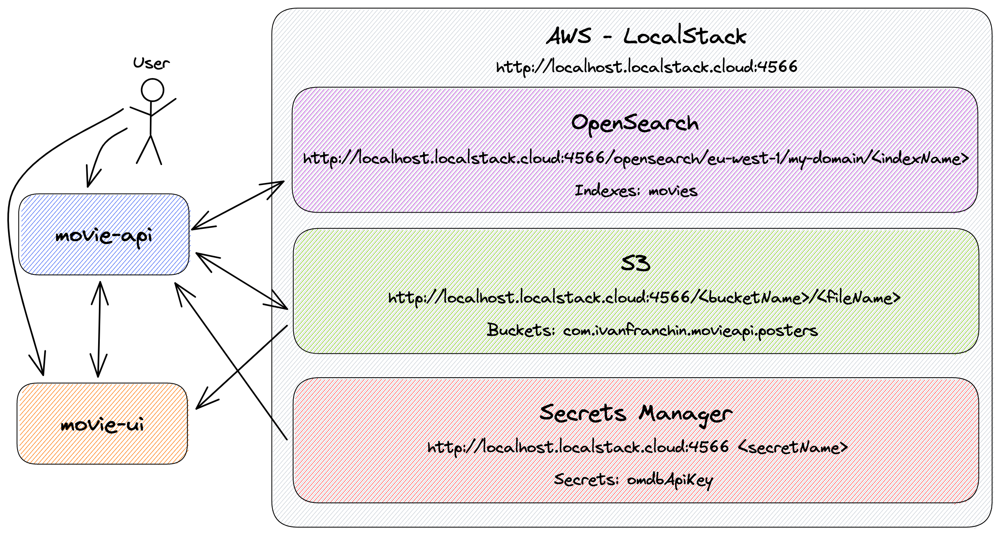
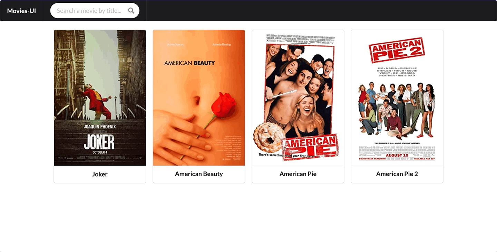

# springboot-aws-localstack-opensearch-s3-secretsmanager

In this project, we are going to use [`LocalStack`](https://localstack.cloud/) to simulate locally, some services provided by [`AWS Cloud`](https://aws.amazon.com/) such as [`OpenSearch`](https://aws.amazon.com/opensearch-service/), [`S3`](https://aws.amazon.com/s3/), and [`Secrets Manager`](https://aws.amazon.com/secrets-manager/).

## Project Architecture



## Applications

- ### movie-api

  [`Spring Boot`](https://docs.spring.io/spring-boot/docs/current/reference/htmlsingle/) Java Web application that exposes a REST API and provides a UI for indexing movies.

  It has the following endpoints:
  ```
   GET /api/movies/{imdb}
  POST /api/movies {"imdb":"...", "title":"...", "posterUrl":"...", "year":"...", "released":"...", "imdbRating":"...", "genre":"...", "runtime":"...", "director":"...", "writer":"...", "actors":"...", "plot":"...", "language":"...", "country":"...", "awards":"..."}
  POST /api/movies/{imdb}/uploadPoster
  ```

  The information of the movies, such as `imdb`, `title`, `year`, etc, are stored in `OpenSearch` that is hosted in `LocalStack`. The movie's `poster` are stored in `S3` buckets.

  The `movie-api` has access to [`OMDb API`](https://www.omdbapi.com/) to search and add easily new movies. In order to make request to `OMDb API`, an `apiKey` is needed. This key is stored as a secret in `Secrets Manager`.

- ### movie-ui

  `Spring Boot` Java Web application that has a UI for searching movies indexed in `movie-api`

## Prerequisites

- [`Java 11+`](https://www.oracle.com/java/technologies/downloads/#java11)
- [`Docker`](https://www.docker.com/)
- [`Docker-Compose`](https://docs.docker.com/compose/install/)
- [`OMDb API`](https://www.omdbapi.com/) KEY

  To search movies in `OMDb API`, we need to obtain an API KEY from `OMDb API`. In order to do it, access https://www.omdbapi.com/apikey.aspx and follow the steps provided by the website.

## Start and Initialize LocalStack

- In a terminal, make sure you are in inside `springboot-aws-localstack-opensearch-s3-secretsmanager` root folder

- Start `LocalStack` Docker container
  ```
  DEBUG=1 docker-compose up -d
  ```
  > **Note**: Debug logs are enabled so that we have more insights about what is happening

- Initialize `LocalStack` by running the following script
  ```
  ./init-localstack.sh <OMDB_API_KEY>
  ```
  The script requires `OMDB_API_KEY` as first and unique argument. The script will create:
  - a domain for `OpenSearch` as well as the `movies` index using the `movies-settings.json` provided;
  - bucket `com.ivanfranchin.movieapi.posters` in `S3`;
  - a secret for `OMDB_API_KEY` in `Secrets Manager`.

- \[Optional\] Monitor `localstack` Docker container logs
  ```
  docker logs localstack -f
  ```

## Running applications with Maven

- **movie-api**
  
  In a terminal and, inside `springboot-aws-localstack-opensearch-s3-secretsmanager` root folder, run the following command
  ```
  ./mvnw clean spring-boot:run --projects movie-api -Dspring-boot.run.jvmArguments="-Daws.accessKey=key -Daws.secretAccessKey=secret"
  ```

- **movie-ui**

  In another terminal and, inside `springboot-aws-localstack-opensearch-s3-secretsmanager` root folder, run the command below
  ```
  ./mvnw clean spring-boot:run --projects movie-ui
  ```

## Running applications as Docker container

- ### Build Docker images

  In a terminal and, inside `springboot-aws-localstack-opensearch-s3-secretsmanager` root folder, run the following script
  ```
  ./docker-build.sh
  ```

- ### Run Docker containers

  - **movie-api**
    
    In a terminal, run the following command
    ```
    docker run --rm --name movie-api -p 9080:9080 \
      -e AWS_ACCESS_KEY=key -e AWS_SECRET_ACCESS_KEY=secret \
      --network=springboot-aws-localstack-opensearch-s3-secretsmanager_default \
      ivanfranchin/movie-api:1.0.0
    ```

  - **movie-ui**

    In another terminal, run the command below
    ```
    docker run --rm --name movie-ui -p 9081:9081 \
      -e MOVIE_API_URL=http://movie-api:9080 \
      --network=springboot-aws-localstack-opensearch-s3-secretsmanager_default \
      ivanfranchin/movie-ui:1.0.0
    ```

## Application URL

| Application | Type    | URL                                         |
|-------------|---------|---------------------------------------------|
| `movie-api` | Swagger | http://localhost:9080/swagger-ui/index.html |
| `movie-api` | UI      | http://localhost:9080                       |
| `movie-ui`  | UI      | http://localhost:9081                       |

## Demo

- **Adding movie**: in the GIF below, we are using `movie-api` to add the movie _"American Pie 2"_

  

- **Searching movies**: in the GIF below, we are using `movie-ui` to search for movies

  

## Useful Links

- **OpenSearch**

  Check indexes
  ```
  curl "http://localhost.localstack.cloud:4566/opensearch/eu-west-1/my-domain/_cat/indices?v"
  ```
  
  Simple search
  ```
  curl "http://localhost.localstack.cloud:4566/opensearch/eu-west-1/my-domain/movies/_search?pretty"
  ```

## Shutdown

- To stop the applications, go to the terminal where they are running and press `Ctrl+C`
- To stop and remove `docker-compose` containers, network and volumes, go to a terminal and, inside `springboot-aws-localstack-opensearch-s3-secretsmanager` root folder, run the following command
  ```
  docker-compose down -v
  ```

## Cleanup

To remove the Docker images created by this project, go to a terminal and, inside `springboot-aws-localstack-opensearch-s3-secretsmanager` root folder, run the script below
```
./remove-docker-images.sh
```
