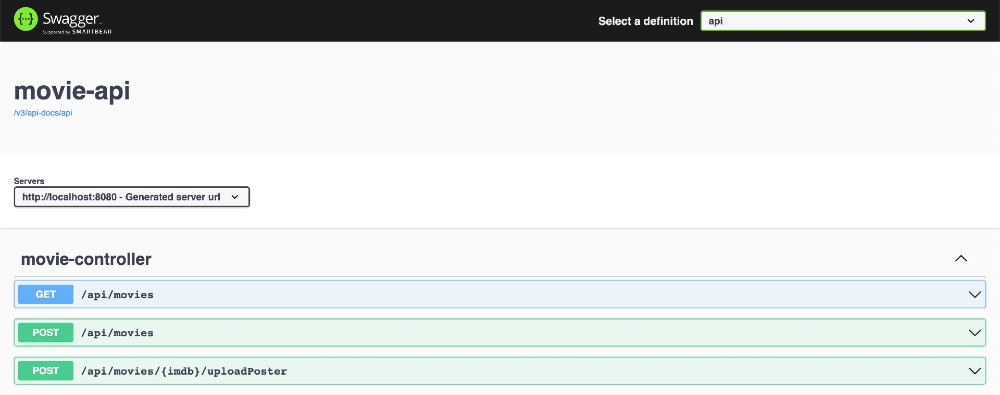
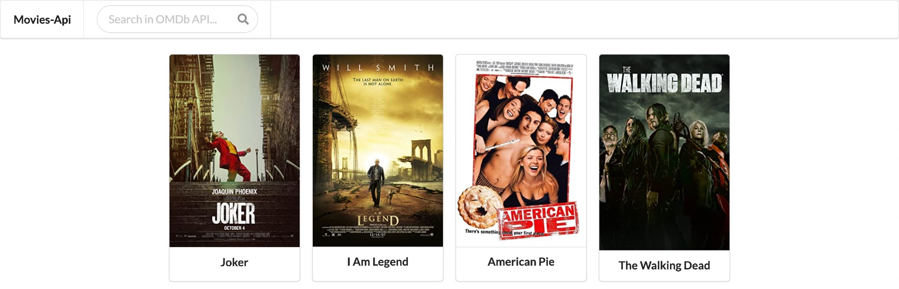

# springboot-aws-localstack-opensearch-s3-secretsmanager

In this project, we are going to use [`LocalStack`](https://localstack.cloud/) to simulate locally, some services provided by [`AWS Cloud`](https://aws.amazon.com/) such as [`OpenSearch`](https://aws.amazon.com/opensearch-service/), [`S3`](https://aws.amazon.com/s3/), and [`Secrets Manager`](https://aws.amazon.com/secrets-manager/).

## Project Architecture


## Application

- ### movie-api

  [`Spring Boot`](https://docs.spring.io/spring-boot/docs/current/reference/htmlsingle/) Java Web application that exposes a REST API and provides a UI for indexing and searching movies.

  The information of the movies, such as `imdb`, `title`, `year`, etc, are stored in `OpenSearch` that is hosted in `LocalStack`. The `poster` of the movies are stored in `S3` buckets.

  The `movie-api` admin has access to [`OMDb API`](https://www.omdbapi.com/) to search and add easily new movies. In order to make request to `OMDb API`, an `apiKey` is needed. This key is stored as a secret in `Secrets Manager`.

## Prerequisites

- [`Java 11+`](https://www.oracle.com/java/technologies/downloads/#java11)
- [`Docker`](https://www.docker.com/)
- [`Docker-Compose`](https://docs.docker.com/compose/install/)
- [`OMDb API`](https://www.omdbapi.com/) KEY

  To search movies in `OMDb API` and add them, we need to obtain an API KEY from `OMDb API`. In order to do it, access https://www.omdbapi.com/apikey.aspx and follow the steps provided by the website.

## Start and Initialize LocalStack

- In a terminal, make sure you are in inside `springboot-aws-localstack-opensearch-s3-secretsmanager` root folder

- Start `LocalStack` Docker container
  ```
  DEBUG=1 docker-compose up -d
  ```

- Initialize `LocalStack`
  ```
  ./init-localstack.sh <OMDB_API_KEY>
  ```
  The script requires `OMDB_API_KEY` as first and unique argument. The script will create:
  - a domain for `OpenSearch` will be created as well as the `movies` index using the `movies-mapping.json` provided;
  - the `S3` bucket `com.mycompany.movieapi.posters`;
  - a secret for `OMDB_API_KEY`.

## Running application with Maven

In a terminal and, inside `springboot-aws-localstack-opensearch-s3-secretsmanager` root folder, run the following command
```
./mvnw clean spring-boot:run --projects movie-api -Dspring-boot.run.jvmArguments="-Daws.accessKey=key -Daws.secretAccessKey=secret"
```

## Running application as Docker container

- ### Build Docker image

  In a terminal and, inside `springboot-aws-localstack-opensearch-s3-secretsmanager` root folder, run the following script
  ```
  ./docker-build.sh
  ```

- ### Run Docker container

  In a terminal, run the following command
  ```
  docker run --rm --name movie-api -p 8080:8080 \
    -e AWS_ACCESS_KEY=key -e AWS_SECRET_ACCESS_KEY=secret \
    --network=springboot-aws-localstack-opensearch-s3-secretsmanager_default \
    ivanfranchin/movie-api:1.0.0
  ```

## Application URL

| Application | Type       | URL                                         | Screenshot                              |
|-------------|------------|---------------------------------------------|-----------------------------------------|
| `movie-api` | Swagger    | http://localhost:8080/swagger-ui/index.html |   |
| `movie-api` | UI (admin) | http://localhost:8080/admin/movies          |  |
| `movie-api` | UI (user)  | http://localhost:8080/user/movies           |   |

## Useful Links

- **OpenSearch**

  Check indexes
  ```
  curl "http://localhost.localstack.cloud:4566/opensearch/eu-west-1/my-domain/_cat/indices?v"
  ```
  
  Simple search
  ```
  curl "http://localhost.localstack.cloud:4566/opensearch/eu-west-1/my-domain/movies/_search?pretty"
  ```

## Shutdown

- To stop application, go to the terminal where it is running and press `Ctrl+C`
- To stop and remove `docker-compose` containers, network and volumes, go to a terminal and, inside `springboot-aws-localstack-opensearch-s3-secretsmanager` root folder, run the following command
  ```
  docker-compose down -v
  ```

## Cleanup

To remove the Docker images created by this project, go to a terminal and, inside `springboot-aws-localstack-opensearch-s3-secretsmanager` root folder, run the script below
```
./remove-docker-images.sh
```
